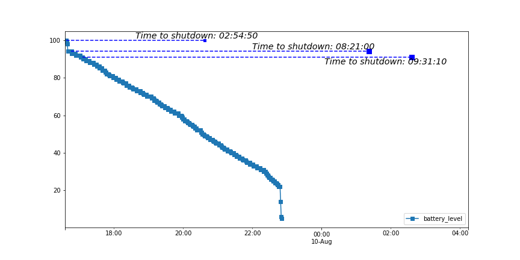

# Battery-Project

The amount of time a battery can power a device without needing to be recharged, is a crucial factor in the usability and convenience of modern technology. The ability for a battery to provide a long-lasting, reliable source of power is especially important for mobile devices which are often used on-the-go and away from electrical outlets.
Predicting the time to shut down of a battery is critical for ensuring the proper functioning of a wide range of devices. By accurately predicting the remaining battery life, users can plan their activities and use their devices accordingly, avoiding sudden shutdowns and potential data loss.

This project is motivated by the wrong indication about the battery autonomy displayed on my laptop, which has led me to sample data about the battery state.

